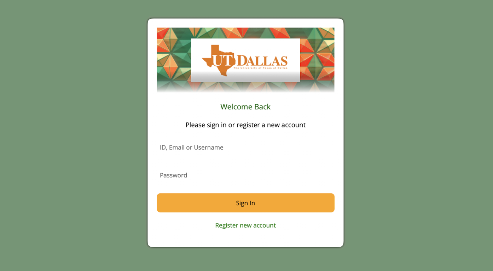
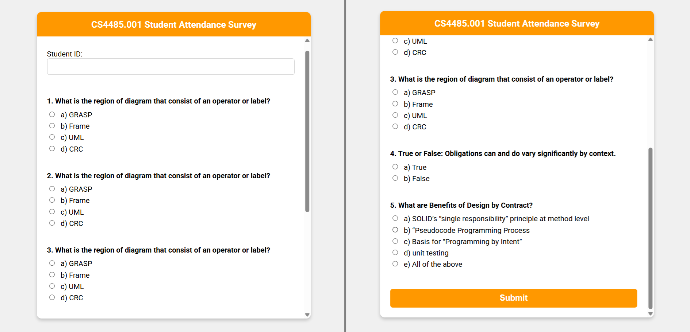
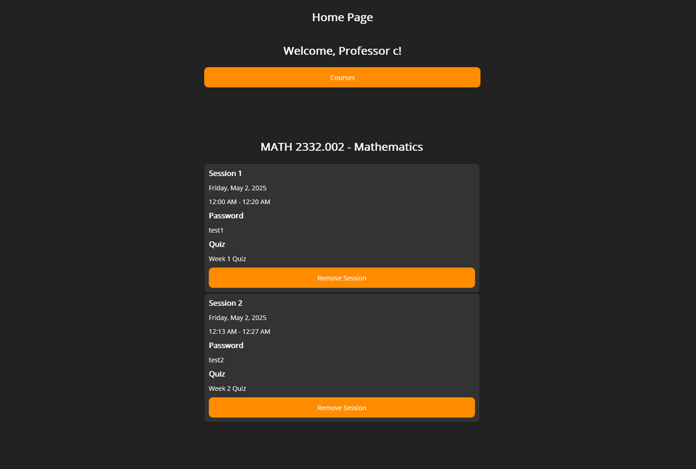
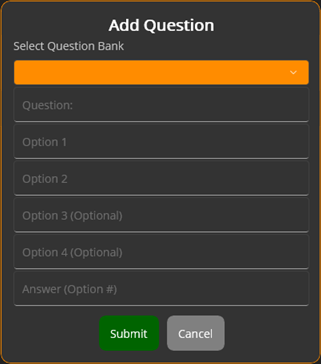

# Attendance System Computer Science Project

## Project Overview
This project is a secure, student-facing attendance portal designed to streamline and safeguard classroom attendance for both students and professors. The system enables students to submit their attendance online while employing device/IP validation and session-locking logic to prevent duplicate or fraudulent submissions. 

Built for academic environments, it empowers professors with robust session management and real-time attendance tracking, while providing students with a simple, user-friendly interface. Standout features include secure authentication, responsive design, and backend logic that ensures data integrity and privacy.

## Tech Stack

**Frontend:** Blazor (Razor Components) (for student attendance form page), .NET MAUI (for professor app)

**Backend:** ASP.NET Core Web API

**Database:** MySQL

**Shared Models:** .NET Shared DTOs project

**Authentication:** JWT (JSON Web Tokens)

**Other Tools:** Entity Framework Core, CommunityToolkit.Maui, Microsoft.Extensions.DependencyInjection

## Features
- Platform-Optimized Experience: Students access a streamlined web-based attendance portal, while professors manage classes and track attendance through a dedicated desktop application built with .NET MAUI for enhanced performance and usability.


- Secure Authentication & Role Management: JWT-based login with distinct permissions and views for professors and students.
- Course & Session Management: Professors can create courses, upload student rosters, and schedule sessions with specific attendance windows.

- Access Code-Based Attendance: Each session generates a unique code; students must enter it to access and submit attendance quizzes.
- Real-Time Attendance Tracking: Attendance records update instantly and can be filtered or exported by professors.
- Automatic Absence Detection: A background service marks students as unexcused if they don’t submit a quiz during an active session.
- IP & UTDID Validation: Prevents multiple submissions and proxy attendance by verifying device/IP and student identity.
- Dynamic Quiz Builder: Professors assemble quizzes by selecting questions from a course-specific question bank.

- Post-Submission Lockout: Students cannot resubmit or navigate back after submitting a quiz, ensuring data integrity.
- Scalable & Modular Architecture: Built with Blazor, ASP.NET Core, .NET MAUI, and MySQL using modular services and DTOs.

## Steps to run
1. Clone the repository

2. Navigate to the AttendanceSystem folder
````
cd AttendanceSystem
````

3. Restore NuGet packages

````
dotnet restore
````

4. Build the project
````
dotnet build
````
5. Run the project
````
dotnet run
````
6. Navigate to the AttendanceSystem folder
````
cd AttendanceSystem
````
7. Open the browser and navigate to `http://localhost:5225`
